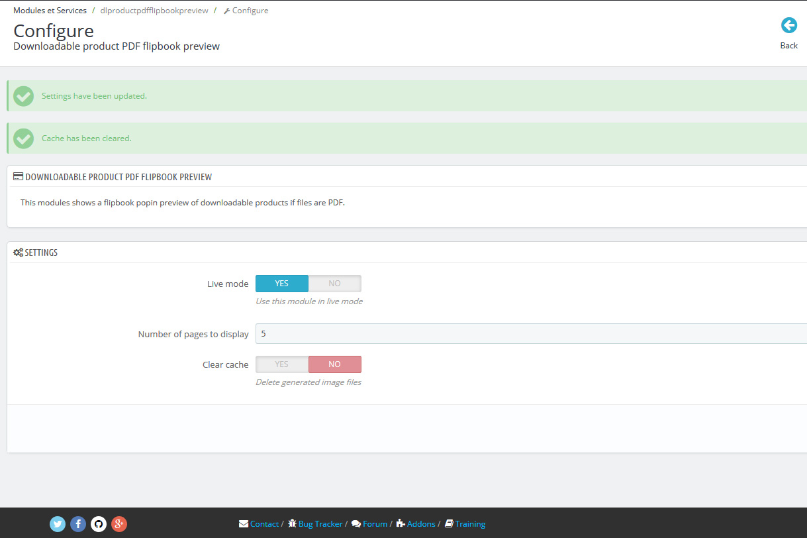
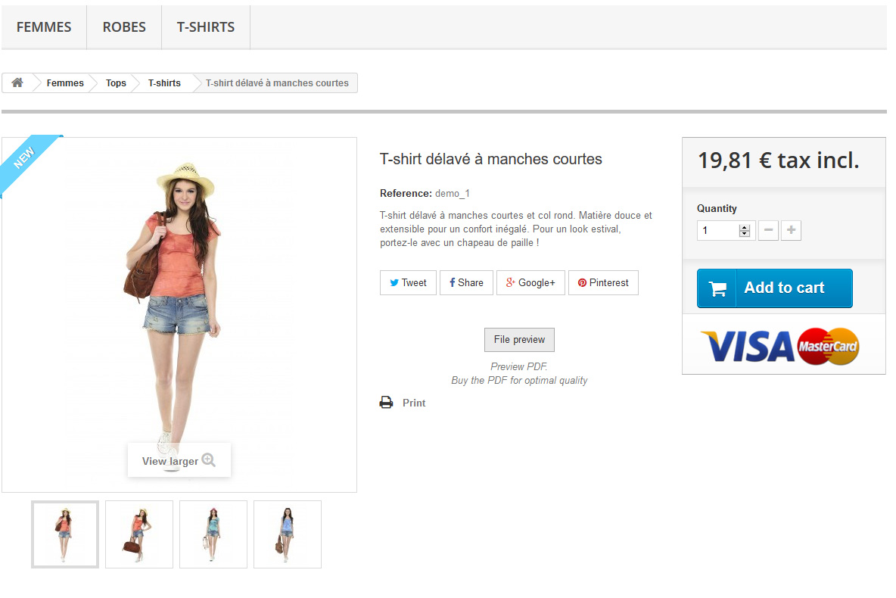
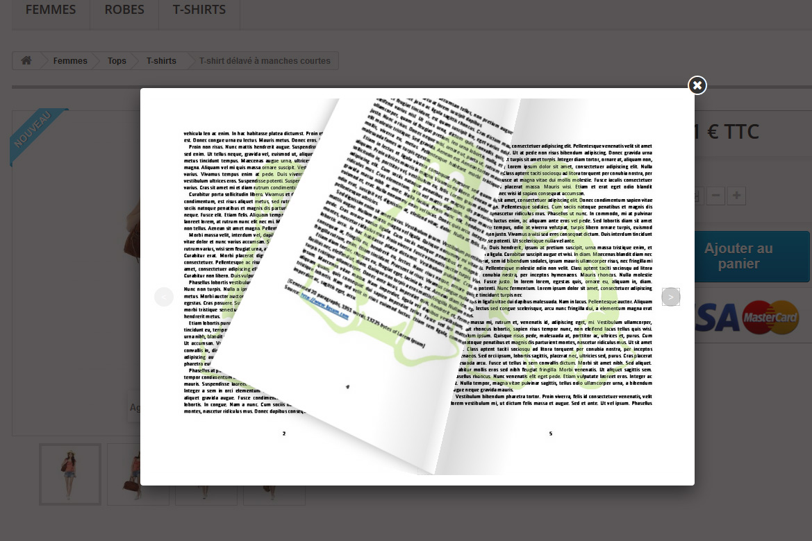

# Downloadable product PDF flipbook preview

Prestashop 1.6 Module

This module was refused on Prestashop Addons Marketplace because it needs Imagemagick PHP extension to be Installed on the server, so I give it for free :)

## Overview

This modules shows a flipbook popin preview of downloadable virtual products if files are PDF.

The generated image files are stored in cache so it doesn't have any impact on website performance after the first display of a product.

## What this module does for you

If you sell books, manuals, etc., your customers can have a preview of the product, which can be a good selling argument.

## Features

A new button is displayed on the product page : "File preview".

The preview is displayed in a fancybox, with beautiful turning page effect (flipbook).

You can set the number of pages to display.

## What your customers will like

Customers can preview the file before they buy it.

## Installation

Quick installation by .zip file upload in backoffice.

## System requirements

Your prestashop have to be 1.6.

Imagemagick PHP extension must be installed on the server to convert PDFs in images.

http://php.net/manual/book.imagick.php

## Screenshots

